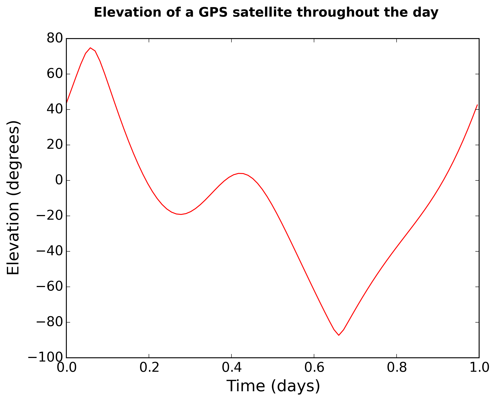

# GPSTk Python Examples

Examples of using
[GPSTk](https://github.com/SGL-UT/GPSTk)
from Python.
The examples included by GPSTk are somewhat broken for Python.
Some
[examples](http://www.gpstk.org/pythondoc/examples.html)
were originally written for GPSTk 2.2, but we fixed them to work with GPSTk 2.10.

GPSTk Python [install procedure](https://scivision.dev/gpstk-anaconda-python/)

## Examples

1. current time in several formats: `./example1.py`
2. basic RINEX read/write/query: `./example2.py`
3. compute biased multipath observation: `./example3.py`
4. compute receiver position error using OBS, NAV and MET: `./example4.py`
5. plot elevation for the day: `./example5.py`
6. numerous time format conversions: `./example6.py -h`

